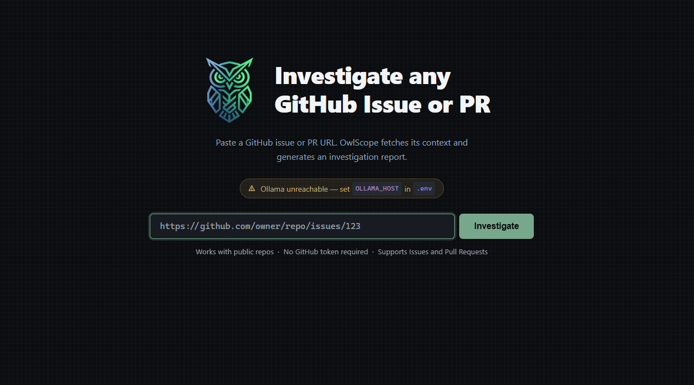

<p align="center">
  
</p>

<h1 align="center">OwlScope</h1>

<p align="center">
  Paste a GitHub issue or PR URL. Get a full investigation report back in seconds.
</p>

<p align="center">
  
  
  
  
  
</p>

---

## What it does

Understanding a GitHub issue or PR usually means cloning the repo, opening a bunch of files, reading through comments, and tracing how the code connects, before you can even start fixing or reviewing anything. That's time spent just getting oriented, not actually solving the problem.

<p align="center">
  
</p>

OwlScope skips that step. Give it an issue or PR URL and it pulls the real context straight from GitHub, the description, comments, diff, and the actual source files involved, and turns it into a structured report: what's broken, what it affects, where the root cause likely is, how to fix it, what tests to write, and whether there's any security concern. It's not a replacement for reading the code, it just gets you oriented fast so you know exactly where to look.

It uses a local LLM through Ollama, mainly because that made it easy to build and run as a demo without needing an API key or paying per request. It doesn't have to stay fully offline, swapping `llm_client.py` for a hosted model (OpenAI, Claude, etc.) is a small change if you'd rather do that.


---

## Table of Contents

- [How It Works](#how-it-works)
- [The 8 Report Sections](#the-8-report-sections)
- [Project Structure](#project-structure)
- [Getting Started](#getting-started)
- [Configuration](#configuration)
- [Usage](#usage)
- [Testing](#testing)
- [Contributing](#contributing)
- [License](#license)

---

## How It Works

```
User pastes URL
      │
      ▼
Flask parses github.com/owner/repo/issues|pull/N
      │
      ▼
GitHub API fetches:
  • Issue/PR metadata (title, body, labels, state, author, dates, comments)
  • PR diff + changed file list (if PR)
  • Repository file tree (up to 300 entries, recursive)
  • Content of up to 5 most relevant source files (scored by mention + diff)
      │
      ▼
Context assembled into a structured text block (~18k chars)
      │
      ▼
Local LLM (via Ollama) generates all 8 sections in one shot
      │
      ▼
Report rendered as collapsible cards in the browser
      │
      ▼
User downloads as Markdown or prints to PDF
```

**Parsing the URL.** A regex pulls out `owner`, `repo`, `number`, and whether it's an issue or a PR, from either `github.com/owner/repo/issues/N` or `github.com/owner/repo/pull/N`.

**Pulling context from GitHub.** All done through the free GitHub REST API, no cloning, no OAuth needed for public repos:

| Data | Detail |
|---|---|
| Issue metadata | title, body, state, labels (real hex colors), author, avatar, timestamps, comment count |
| Comments | up to 100, each with author + body |
| PR details | head/base branches, changed files, additions/deletions, diff patches (capped at 3,000 chars/file) |
| Repo file tree | recursive, up to 300 entries |
| Relevant source files | top 5, picked by whether they're mentioned in the issue, show up in the diff, or sit at the repo root, capped at 4,000 chars each |

Add a GitHub Personal Access Token to `.env` if you're going to be using this a lot, it bumps the rate limit from 60 requests/hour to 5,000.

**Building the prompt.** Everything is serialized into one context block, capped around 18,000 characters so it fits comfortably in a 7B model's context window. A system prompt frames the model as a senior engineer doing a review, and each section gets its own targeted instruction.

**Rendering the report.** The response comes back as 8 named sections, each rendered as a collapsible card with proper Markdown, fenced code blocks, tables, the works. First section is open by default.

---

## The 8 Report Sections

| # | Section | What it gives you |
|---|---------|--------------------|
| 1 | **Issue Summary** | A plain-language version of what's broken or being asked for, with repro steps if it's a bug |
| 2 | **Feature Impact** | Which routes, endpoints, or user flows are touched, or what a PR actually changes for users |
| 3 | **Code Impact** | The specific files, classes, and functions involved, with a reason for each one |
| 4 | **Call Graph / Visualization** | A quick text call chain, e.g. `route → handler → function` |
| 5 | **Root Cause Location** | Best guess at the file(s) and line(s) causing the problem, backed by the diff and issue text |
| 6 | **Fix Suggestions** | One or two real approaches, with code and a pros/cons breakdown |
| 7 | **Test Generation** | Named test cases you could actually write, in whatever framework fits the repo |
| 8 | **Security Impact** | Whether the change opens up anything around injection, auth, data exposure, etc., "nothing here" is a fine answer if that's genuinely the case |

<details>
<summary><b>Example from a real run: <code>openfaas/python-flask-template</code> PR #73</b></summary>

> **Issue Summary**: Modern Docker build systems were skipping the `test` layer entirely because nothing in the Dockerfile actually depended on it before the `ship` layer.
>
> **Root Cause Location**: `template/python3-flask-debian/Dockerfile`, lines 48 and 50. The `ship` stage builds off `build`, not `test`, so the test layer gets discarded.
>
> **Fix Suggestions**: Change `FROM build as ship` to `FROM test as ship` so the test stage is forced into the build path.
>
> **Security Impact**: None. It's a build-process change, doesn't touch runtime code or data handling.

</details>

Every report also opens with a header showing the issue/PR type and state, the repo and number, title, author, dates, comment count, branch flow for PRs, and the actual GitHub label colors.

---

## Project Structure

```
OwlScope/
├── app.py                  # Flask routes, Jinja filters, download endpoint
├── config.py               # Environment variable loading
├── github_fetcher.py       # GitHub REST API calls, URL parsing, file scoring
├── report_generator.py     # LLM prompts, section generation, context serializer
├── llm_client.py           # Ollama HTTP client, connection check
├── cache.py                # File-based JSON report cache
├── context_builder.py      # Context assembly helpers
├── requirements.txt        # Python dependencies
├── .env.example            # Environment variable template
├── static/
│   ├── style.css           # Full dark-theme stylesheet
│   ├── icon.png            # OwlScope owl logo
│   └── screenshot.png      # App screenshot for the README
└── templates/
    ├── base.html            # Base layout, footer
    ├── index.html           # Home page, input form, recent reports
    └── report.html          # Report page, header, TOC, section cards
```

---

## Getting Started

### Prerequisites

| Requirement | Version | Notes |
|---|---|---|
| Python | 3.10+ | 3.11 recommended |
| Ollama | latest | https://ollama.com, needs to be running locally |
| Ollama model | any | Default is `qwen2.5-coder:7b`, pull it before your first run |

### 1. Clone the repository

```bash
git clone https://github.com/your-username/owlscope.git
cd owlscope/OwlScope
```

### 2. Create a virtual environment

```bash
python -m venv .venv

# Windows
.venv\Scripts\activate

# macOS / Linux
source .venv/bin/activate
```

### 3. Install dependencies

```bash
pip install -r requirements.txt
```

### 4. Configure environment

```bash
cp .env.example .env
```

Then edit `.env`:

```env
# Local Ollama (default)
OLLAMA_HOST=http://localhost:11434

# Or point at a remote Ollama via an ngrok tunnel
# OLLAMA_HOST=https://xxxx.ngrok-free.app

OLLAMA_MODEL=qwen2.5-coder:7b

# Optional, raises the GitHub API rate limit from 60 to 5000 req/hour
GITHUB_TOKEN=your_github_pat_here

# Change this to a long random string if you ever deploy this
FLASK_SECRET_KEY=your-secret-key
```

### 5. Pull the Ollama model

```bash
ollama pull qwen2.5-coder:7b
```

Any model you have in Ollama will work, bigger models (14B+) tend to give more detailed reports if your machine can handle them.

### 6. Start Ollama

```bash
ollama serve
```

### 7. Run OwlScope

```bash
python app.py
```

Then open **http://localhost:5000**.

---

## Configuration

| Variable | Default | Description |
|---|---|---|
| `OLLAMA_HOST` | `http://localhost:11434` | Ollama server URL. Works with ngrok tunnels too if you're running Ollama elsewhere. |
| `OLLAMA_MODEL` | `qwen2.5-coder:7b` | Any model installed in your Ollama instance. |
| `GITHUB_TOKEN` | *(empty)* | Optional PAT, bumps the rate limit to 5,000 req/hour. |
| `FLASK_SECRET_KEY` | *(dev default)* | Flask session secret, change it before deploying anywhere real. |
| `CACHE_DIR` | `./cache` | Where cached report JSON files get stored. |

---

## Usage

1. Open `http://localhost:5000`
2. Check that the "Ollama connected" badge is green
3. Paste a GitHub issue or PR URL, for example:
   - `https://github.com/openfaas/python-flask-template/pull/73`
   - `https://github.com/django/django/issues/16403`
4. Click **Investigate**
5. Give it 15-45 seconds, depending on your model size
6. Expand the sections you care about
7. Use the **Jump To** pills to skip around
8. Download as Markdown, or print to PDF

---

## Testing

```bash
pytest tests/
```

---

## Contributing

If you find this useful and want to extend it, go for it. Fork it, branch off, add or update tests under `tests/`, make sure `pytest tests/` passes, and open a PR explaining what you changed and why.

---

## License

MIT, see [LICENSE](LICENSE).